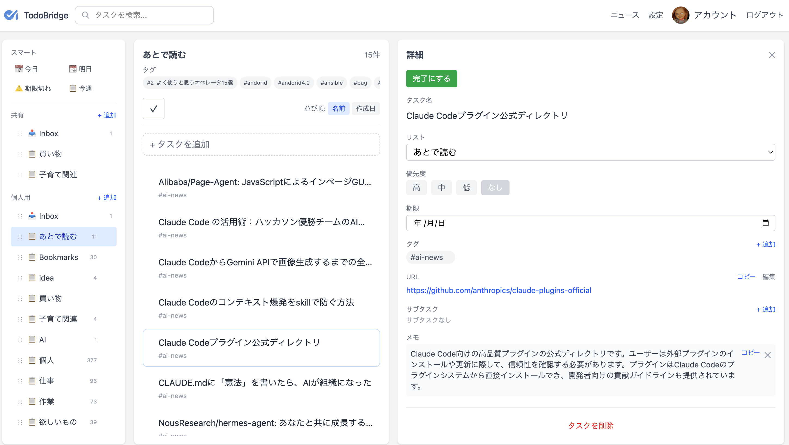
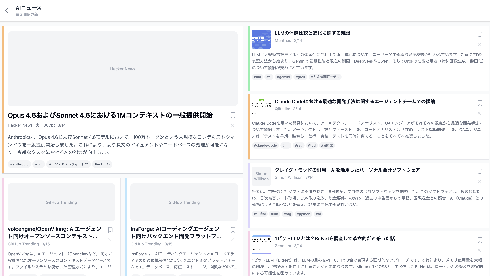
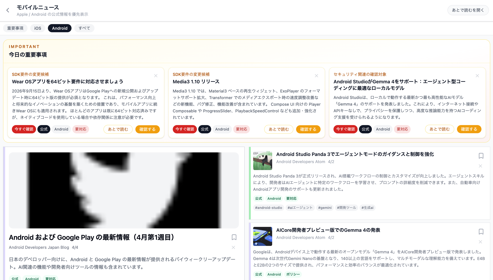

# TodoBridge


TodoBridge は、RTM代替を目指した、共有対応のタスク管理アプリです。
加えて、AI / iOS / Android などの海外記事も含む情報を集め、日本語で把握しやすく整理して Todo に繋げられます。

## Screenshots

### ホームでタスクと情報をまとめて確認



### 海外の技術記事を日本語で把握しやすく整理



### iOS / Android の更新を確認優先の項目つきで追いやすく表示



iOS / Android アプリ開発で見逃したくない更新を、確認優先の項目と通常の記事一覧に分けて把握しやすくしています。

## このアプリを作った目的

- 複数人で Todo を共有できる構造を持たせたかった
- これまで RSS を1つずつ巡回して集めていた AI / iOS / Android ニュースを、AI を使って効率よく収集したかった
- 集めた情報を、あとで読む・対応する Todo へ自然に繋げられるようにしたかった
- Remember The Milk の置き換えとして使えるアプリが欲しかった
- 将来的には、AI だけでなく育児や金融のような、個人でも家族でも追いたい関心テーマを選べるようにしたかった

## 技術スタック

- フロントエンド: Vue 3, TypeScript, Vite, Pinia
- バックエンド: Firebase Authentication, Firestore, Cloud Functions, Cloud Storage
- テスト: Vitest, Playwright

## 主な機能

- タスク一覧と詳細表示
- 複数人での共有を見据えたデータ構造
- 海外記事も含めて収集し、日本語で把握しやすくする翻訳・要約
- AI / iOS / Android などの関心テーマに応じた情報表示
- 情報をあとで読む・対応する Todo へ自然に繋げる構造
- Remember The Milk 形式のインポート
- Google ログイン

## セットアップ

### 必要環境

- Node.js
- pnpm
- Firebase CLI

### 環境変数

フロントエンドでは以下の環境変数を使用します。

```bash
VITE_FIREBASE_API_KEY=
VITE_FIREBASE_AUTH_DOMAIN=
VITE_FIREBASE_PROJECT_ID=
VITE_FIREBASE_STORAGE_BUCKET=
VITE_FIREBASE_MESSAGING_SENDER_ID=
VITE_FIREBASE_APP_ID=
VITE_FIREBASE_MEASUREMENT_ID=
```

Cloud Functions では以下を使用します。

```bash
GEMINI_API_KEY=
```

### 開発コマンド

フロントエンド:

```bash
cd web
pnpm install
pnpm dev
```

Cloud Functions:

```bash
cd functions
npm install
npm run build
```

## 検証コマンド

```bash
cd web
pnpm test:run
pnpm type-check
pnpm build
```

Functions:

```bash
cd functions
npm test
```

## AI活用方針

このリポジトリでは AI コーディングエージェントを開発補助に利用しています。ただし、変更方針、根本原因の特定、最終的なレビューと検証は人間が責任を持って行う前提です。

`AGENTS.md` は Codex 向けの設定ファイルであると同時に、このリポジトリで重視している開発原則を機械可読な形でまとめたものです。最小差分、根本原因の修正、対象を絞った検証を重視しています。

## 補足

- 設計メモや実装計画は `doc/` 配下にあります。
- AI を使った開発の進め方は `doc/AI_DEVELOPMENT_WORKFLOW.md` にまとめています。
- プロダクト全体の要件整理は `doc/PRODUCT_REQUIREMENTS.md` にまとめています。
- 要件定義テンプレートは `doc/REQUIREMENTS_TEMPLATE.md` に置いています。
- retrospective な要件定義の例は `doc/RETROSPECTIVE_REQUIREMENTS_EXAMPLE.md` にまとめています。
- テーマ選択型の情報機能の要件と設計メモは `doc/THEMED_FEED_REQUIREMENTS.md` と `doc/THEMED_FEED_DESIGN.md` にまとめています。
- 機能追加時に使うテンプレートは `doc/FEATURE_IMPLEMENTATION_TEMPLATE.md` に置いています。
- Firebase や API キーなどの秘密情報はリポジトリに含めない前提です。
